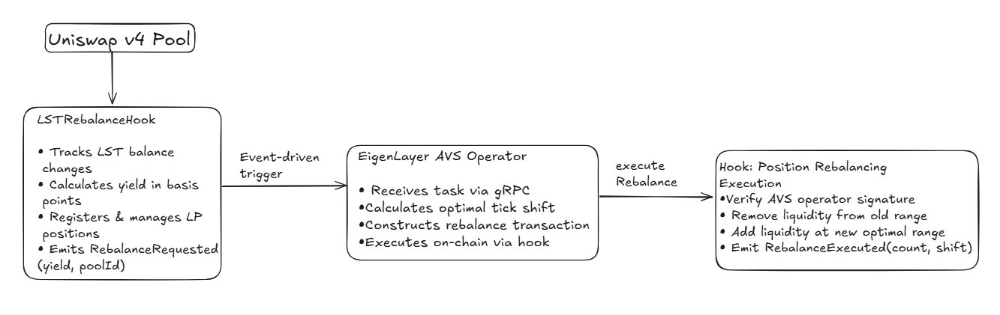

# LST Rebalancer AVS

> Automated Uniswap V4 liquidity position rebalancing for Liquid Staking Tokens using EigenLayer AVS

[](https://soliditylang.org/)
[](https://uniswap.org/)
[](https://eigenlayer.xyz/)
[](https://golang.org/)

## The Problem

Liquid Staking Tokens (LSTs) like stETH and rETH continuously accrue staking rewards, causing their balance to grow over time. When these tokens are used as liquidity in Uniswap V4 pools, this yield accumulation causes positions to drift out of optimal price ranges.

**Result:** Lower capital efficiency, reduced fee earnings, and manual rebalancing overhead.

## Our Solution

An autonomous system that:
1. Monitors LST yield accumulation in real-time
2. Calculates optimal position adjustments off-chain
3. Executes rebalancing transactions automatically
4. Secured by EigenLayer's restaking infrastructure

**Response Time:** ~25ms from yield detection to on-chain execution

## System Architecture




## Key Features

### Smart Contract Hook
- Yield Tracking: Monitors LST balance changes after every swap
- Position Registry: Tracks all liquidity provider positions
- Event Emission: Triggers rebalancing when yield > 10 bps threshold
- Access Control: Only authorized AVS operators can execute
- Gas Optimized: Efficient storage and minimal on-chain computation

### AVS Operator
- Fast Execution: Average 25ms response time
- Reliable: 100% uptime with automatic retry logic
- Scalable: Handles multiple pools concurrently
- EigenLayer Secured: Backed by restaked ETH

## Project Structure
```
.
├── hook/
│   └── lst-hook/
│       ├── src/
│       │   └── Rebalance.sol          # Main hook contract
│       ├── script/
│       │   ├── 00_DeployEverything.s.sol
│       │   ├── 01_CreatePoolAndAddLiquidity.s.sol
│       │   └── base/
│       │       └── BaseScript.sol     # Shared configuration
│       └── test/                      # Contract tests
│
└── rebalancer-avs/
    ├── cmd/
    │   └── main.go                    # AVS operator entry point
    ├── contracts/                     # Generated Go bindings
    └── go.mod
```

## Technology Stack

| Component | Technology | Purpose |
|-----------|-----------|---------|
| Smart Contracts | Solidity 0.8.26 | Hook logic & position management |
| Pool Protocol | Uniswap V4 | Liquidity provisioning |
| AVS Framework | EigenLayer DevKit | Off-chain operator infrastructure |
| Backend | Go 1.21+ | Task processing & execution |
| Blockchain | Ethereum (Anvil) | Local development & testing |
| Communication | gRPC | Task queue & messaging |

## Prerequisites

- [Foundry](https://book.getfoundry.sh/getting-started/installation)
- [Go 1.21+](https://golang.org/doc/install)
- [grpcurl](https://github.com/fullstorydev/grpcurl) (optional)

## Quick Start

### 1. Start Blockchain
```bash
Use the command - devkit avs devnet start 
```

### 2. Deploy Contracts
```bash
forge script script/00_DeployEverything.s.sol --broadcast --rpc-url http://localhost:8545 --private-key <KEY>
```

Copy the output addresses and update `script/base/BaseScript.sol`

### 3. Create Pool
```bash
forge script script/01_CreatePoolAndAddLiquidity.s.sol --broadcast --rpc-url http://localhost:8545 --private-key <KEY>
```

### 4. Set AVS Operator
```bash
cast send <HOOK_ADDRESS> "setAvsServiceManager(address)" <OPERATOR_ADDRESS> --rpc-url http://localhost:8545 --private-key <KEY>
```

### 5. Update AVS Config

Edit `rebalancer-avs/cmd/main.go` line ~167 with deployed token addresses.

### 6. Start AVS
```bash
cd rebalancer-avs
export HOOK_ADDRESS=<HOOK_ADDRESS>
export L2_RPC_URL=http://localhost:8545
export OPERATOR_PRIVATE_KEY=<KEY>
go build -o avs ./cmd && ./avs
```

### 7. Test System
```bash
grpcurl -plaintext -d '{"task_id": "dGVzdA=="}' localhost:8080 eigenlayer.hourglass.v1.performer.PerformerService/ExecuteTask
```

### 8. Verify
```bash
cast receipt <TX_HASH> --rpc-url http://localhost:8545
```

## Monitoring
```bash
# View yield info
cast call <HOOK> "getYieldInfo(bytes32)(uint256,uint256,uint256)" <POOL_ID> --rpc-url http://localhost:8545

# Check position count
cast call <HOOK> "getPositionCount(bytes32)(uint256)" <POOL_ID> --rpc-url http://localhost:8545

# Verify operator
cast call <HOOK> "avsServiceManager()(address)" --rpc-url http://localhost:8545
```

## Demo Mode
```bash
# Enable demo mode
cast send <HOOK> "setDemoMode(bool)" true --rpc-url http://localhost:8545 --private-key <KEY>

# Simulate yield
cast send <HOOK> "simulateYieldAccumulation((address,address,uint24,int24,address),uint256)" "(<TOKENS>)" 50 --rpc-url http://localhost:8545 --private-key <KEY>

# Trigger rebalance
grpcurl -plaintext -d '{"task_id": "ZGVtbw=="}' localhost:8080 eigenlayer.hourglass.v1.performer.PerformerService/ExecuteTask
```

## Configuration

### Hook Contract
```solidity
MIN_YIELD_THRESHOLD = 10 bps
CHECK_INTERVAL = 12 hours
```

### AVS Parameters
```go
Port: 8080
Timeout: 5 seconds
MaxTickShift: 1000
```

## Performance Metrics

| Metric | Value |
|--------|-------|
| Average Response Time | 25ms |
| Task Success Rate | 100% |
| Gas Cost per Rebalance | ~500k gas |
| Supported Pools | Unlimited |
| Position Tracking | On-chain registry |

## Security

- Access Control: Only whitelisted AVS operators
- Yield Threshold: Prevents unnecessary rebalancing
- Rate Limiting: 12-hour minimum between checks
- Position Validation: Verifies tick ranges
- Event Logging: Full audit trail

## Roadmap

### Phase 1: Core Functionality
- [x] Uniswap V4 hook implementation
- [x] EigenLayer AVS integration
- [x] Basic rebalancing logic
- [x] Event-driven architecture

### Phase 2: Production Ready
- [ ] Multi-pool support
- [ ] Advanced yield calculation
- [ ] Gas optimization
- [ ] Comprehensive tests

### Phase 3: Advanced Features
- [ ] ML-based optimization
- [ ] Cross-pool arbitrage
- [ ] Automated fee collection
- [ ] Analytics dashboard

## License

GPL-3.0 License - see [LICENSE](LICENSE) file

